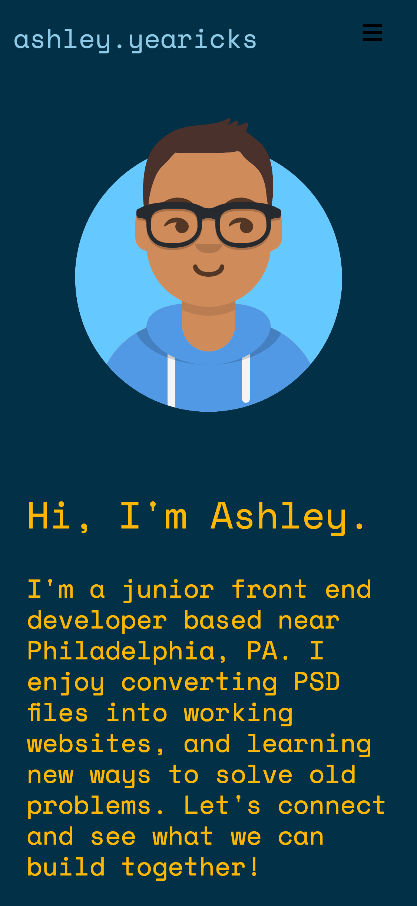
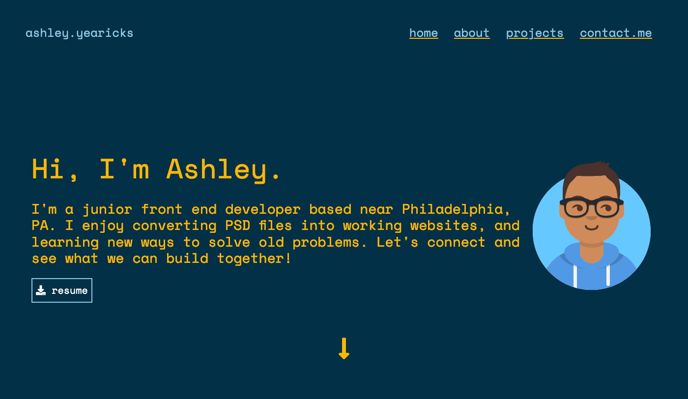

# Ashley Yearicks - Front End Web Developer

This is my personal portfolio website. Go ahead and poke around.

Currently looking for a remote position!

## Table of contents

- [Ashley Yearicks - Front End Web Developer](#ashley-yearicks---front-end-web-developer)
  - [Table of contents](#table-of-contents)
    - [Screenshots](#screenshots)
    - [Links](#links)
    - [Built with](#built-with)
    - [What I learned](#what-i-learned)
    - [Useful resources](#useful-resources)
  - [Author](#author)

### Screenshots

### Links

- Solution URL: [Github Repo](https://github.com/ayearicks/ayearicks.github.io)
- Live Site URL: [Live Site](https://yearicks.dev)

### Built with

- Semantic HTML5 markup
- Bootstrap 5
- CSS custom variables
- Visual Studio Code
- Firefox Developer Edition

### What I learned

This was a great exercise in trying to put myself on a website. From font choices to color palettes, it was a definite challenge to 'sum myself up' in a one page document.

### Useful resources

- [Bootstrap v5 Documentation](https://getbootstrap.com/docs/5.0/getting-started/introduction/) - This is the first project that I've created using Bootstrap v5.0, so these docs were very helpful in finding the changes between v5.0 and v4.6.
- [Impressive Webs](https://www.impressivewebs.com/understanding-em-units-css/) - This whole write up definitely helped me understand the difference, and when to use ems and rems. Highly recommend!

## Author

- Website - [Ashley Yearicks](https://yearicks.dev)
